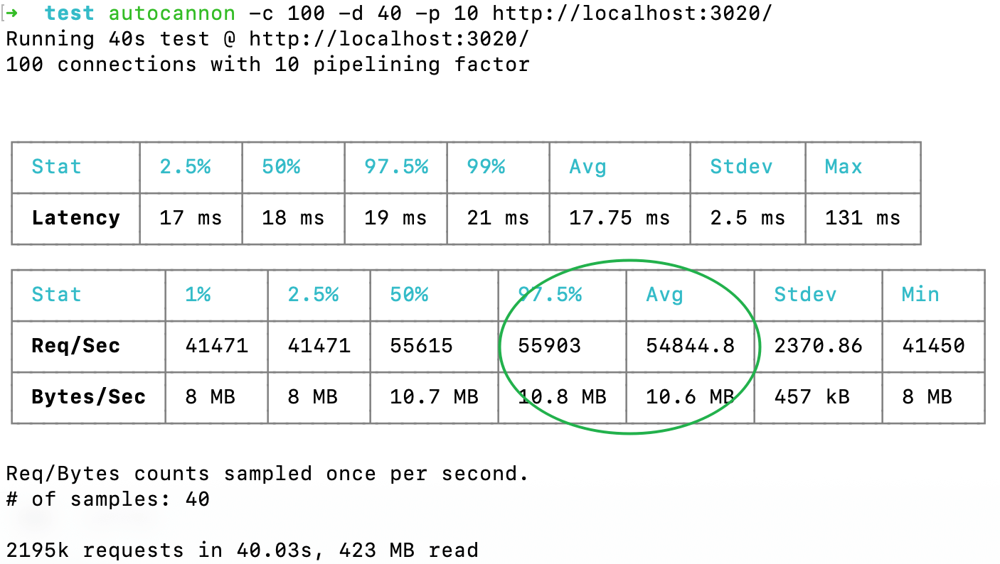

# GledeServer

## 单例模式

目前单个项目中只能创建一个Server实例, 暂时无mono-repo的需求。

若后续使用mono-repo, 则考虑新增配置 `basePath: ''`, 
路由注册、日志记录、文档校验、数据库等操作基于`basePath`

当前文档支持不全, `tests` 目录下有一些基础示例, 另外`d.ts`有些描述，
若您有任何疑问可联系邮箱 `1061393710@qq.com`

## 基于配置启动

[配置类型描述: GledeServerOpts](./types/index.d.ts)

[JSON配置案例: app.json](./tests/configs/app.json)

**推荐！**[TS配置案例: app-config.ts](./tests/configs/app-config.ts)

配置中的服务驱动配置以及环境环境请您自定义。

[服务器日志信息](./tests/logs/error.log) / 
[注册路由状态树](./tests/logs/routers.txt) /
[api文档](./tests/logs/apis.json)  ([导入Apifox工具查看](https://www.apifox.cn/help/app/import/swagger/))

## Benchmark

⚡️ `3~4x faster than` [Express](https://github.com/expressjs/express)

`MacOS; Intel-i5 2.9GHz; Memory-DDR4 32 GB`



```ts
// types/index.d.ts 有详细的描述,手写配置会覆盖conf文件中的对应字段
// 优先级：代码中手写配置 > conf字段文件配置
interface GledeServerOpts {
    // ...
}

// app.ts
import { Server } from 'glede-server';

Server({ conf: 'configs/app.json' }, (err, address) => {
    if (err) {
        console.log(err);
    }
    else {
        console.log(`GledeServer is running at ${address}`);
    }
});
```

## 模版目录结构

- 在您的项目目录下执行 `npm install glede-server` 后参考本项目的`tests`目录创建即可
- 注意引包时使用 `import {...} from 'glede-server';`
- 注意引用类型使用 `import type {...} from 'glede-server';`

```
├── app.ts                      // 服务器启动入口
├── configs                     // 服务器配置
│   ├── app-config.ts           // 服务器配置文件 支持ts和json格式, 可配置多个用于区分运行时环境
│   ├── app.json
│   └── lua                     // lua脚本目录
│       ├── index.ts            // lua脚本导出口
│       └── statList.lua        // 自定义redis lua脚本
├── tsconfig.json               // ts编译配置
├── types                       // ts类型描述
│   ├── server.d.ts             // 默认: /// <reference types="glede-server/types" />
│   └── redis-lua.ts            // 拓展redis指令类型描述
├── controllers                 // DAO, 数据操作对象
│   └── cat.ts
├── demos                       // 基础使用方式
├── crons                       // 定时事务
│   └── test.ts
├── logs                        // 日志目录
│   ├── apis.json               // 配置开启swagger, 在运行时执行生成覆盖接口文档
│   ├── error.log               // 必须存在, 初始化启动需要手动创建
│   └── routers.txt             // 最新的路由信息, 服务器的路由树
└── routers                     // 接口目录
    ├── api
    ├── common
    └── openapi
```

## 路由类

```ts
import { GledeRouter, Get, Post } from 'glede-server';

export class Router extends GledeRouter {
    // 注意方法不要使用箭头函数
    // 1. 依赖原型处理逻辑; 2. 注入依赖工具方便处理请求

    getAllUser(this: GledeThis, data: GledeReqData) {
        // doSomething.

        if (noPass) {
            return {
                // 1 客户端参数校验未通过, 业务无需关心
                // >= 2 自定义
                code: 2,
                data: null,
                msg: '描述错误原因'
            };
        }

        // 以下情景等价于返回 {code:0, data: null}
        // 1. 无return语句
        // 2. return null
        // 3. return;
        // 4. return undefined

        return {
            code: 0, // 0 处理成功
            data: {
                // ...
            }
        };
    }
}
```

## [通用方法](./types/index.d.ts)

- [GledeThis](./types/index.d.ts)

- [GledeUtil](./types/export.d.ts)

- [GledeStaticUtil](./types/export.d.ts)

- [Schema](./types/export.d.ts)

- [Model](./types/export.d.ts)

- [ObjectId](./types/export.d.ts)

## 路由注册

### 注册不带前缀的路由

非index文件或目录会保持大小写被记录到路由中，例如示例中`./api/user/index.ts`中`user`会被注册到 /api/user/$subpath。一下示例中index是不会注册到路由中的，若注册`/index`则需装饰器完成需求：@Get('/index')。

`routers/open?api|common/index/index.ts`

`routers/open?api|common/index.ts`

### 严格注册模式

- 除 '/' 路由外，是否携带 / 需注册不同的 `RouterHandler`

`@Get('')` 和 `@Get('/')`监听的是不同的路由,

`localhost:3020/user`和`localhost:3020/user/` 是不同的路由

```ts
// 目录: routers/api/post
import { Post } from '../controllers';
import { GledeUtil, Get, GledeRouter } from 'glede-server'

export default class extends GledeRouter {
    /**
     * 删除动态
     */
    @Get('/del/:id', { schema: schema.delPost })
    @NeedAuth('user')
    async delPost(this: GledeThis, data: GledeReqData) {
        // Token鉴权通过, 这里可以看到用户身份
        const { token, payload } = this.getToken();
        console.log(payload.role, payload.uid, payload.exp);

        // 指定身份 root 0 | super 1 | admin 2 可下架用户文章
        // const ROLE_USER = 3; 参考类型描述文件 getToken 方法
        if (payload.role < ROLE_USER) {
            Post.deleteOne({ postId: data.params.id });
        }

        // 非管理员, 只能删除自己的文章
        else {
            Post.deleteOne({ postId: data.params.id });
        }
    }
}
```

## 装饰器介绍

### 方法装饰器

> 将Handler装载至路由

- `@Get(url: string, { schema?: GledeGetSchema, version?: string })`
- `@Post(url: string, { schema?: GledePostSchema, version?: string })`

### 跨域装饰器

> 设置需要跨域的域名、方法、是否允许携带cookie

- `@Cors(origin: string | string[], method: string, credential?: boolean)`

### 鉴权装饰器

> 身份鉴权(noauth | user | admin | super | root), 是否允许Handler处理
Default: noauth

- `@NeedAuth(role: string)`

### 验签装饰器

> 签名验证, 是否允许Handler处理

- `@NeedSign()`

```ts
/**
 * 1. 客户端 摘要过程
 */

// 通过登陆等鉴权接口拿到 'MTcwMjE0MTE0Mzg5M183ODk4.BGZh4oyyHMWAWkiVSJptV5yNb7w'

// 切割取第二部分缓存
const signKey = 'BGZh4oyyHMWAWkiVSJptV5yNb7w';

// 切割取第一部分, 需要随请求报文发送到服务端
const content = 'MTcwMjE0MTE0Mzg5M183ODk4';

// 要发送的报文体
const payload = JSON.stringify({ name: 'Kitty' });

// 同服务端约定的本项目的key
const baseKey = '007';

// 请求方法 uppercase
const method = 'POST' as 'POST' | 'GET';

// /开头的url上的query
const query = '/?test=001';

// 一个空格分割method 和 query
const head = method + ' ' + query;

function stringify(content) {
  if (method === 'GET') {
    return '';
  }
  if (method === 'POST') {
    return typeof content === 'string' ? content : JSON.stringify(content);
  }

  return '';
}

function getSign(head, payload) {
  return content + '.' + sha1(signKey + baseKey + head + stringify(payload));
}

function sendRequest() {
  return fetch('http://localhost:3020/?test=001', {
    method: 'POST',
    headers: {
      signature: getSign(head, payload)
    },
    body: stringify(payload)
  }).then(res => res.json());
}

sendRequest().then(res => {
  console.log(res);
});
```

## 数据库操作

[mongoose 操作文档](https://mongoosejs.com/docs/api/model.html)

### 定义数据模型

> 📢 参考DEMO: ./tests/controllers/cat.ts <br>
> cat 对应了数据库中的集合名称 cats, 起名字要使用单数！否则需要指定集合名字

```ts
import { Model } from '@/index';

// 模型数据结构
const CatSchema = {};

// 模型自定义
const CatOpts = {
    // 指定集合名, 此时集合链接到了cat, 默认是cats
    collection: 'cat',

    // 添加便捷方法, 注意不要使用箭头函数！
    // 可以这样使用：Cat.findByName('^cool').then(res => {});
    statics: {
        findByName(name: string) {
            return this.find({ name: new RegExp(name, 'i') });
        }
    }
};

export default Model('cat', CatSchema, CatOpts);
```

### 操作数据模型

```ts
import Cat from '@/tests/controllers/cat';

// 1. 在Cat表中插入一条数据, 后面Demo默认包裹在try-catch中
try {
    await Cat.create({
        // 插入数据格式必须是CatSchema中定义, 否则字段会被忽略
    });
}
catch (err) {/* Handle Error */}

// 2. 在Cat表中查找一条数据, 随便找一只名叫 cool_xx 且小于2岁的🐱
// 非常不推荐正则, 除非搜索过滤等场景。一般在任何语言中的实现都是最慢最耗性能的模式匹配。
// 不过有的语言实现了正则的缓存, 可能在某些场景下会快。尽量不用吧！
Cat.findOne({
    name: new RegExp('^cool_', 'i'),
    age: { $lt: 2 }
});

// 3. 在Cat表中找到一条匹配的数据，删除
Cat.deleteOne({});

// 4. 在Cat表中找到所有可以匹配删除的数据
Cat.deleteMany({});

// 5. 在Cat表中找到数据并更新, upsert默认为false, 设置为true不存在就插入
// 注意原子操作, filter, { $set: { name: '小小明' } }, options
Cat.updateOne({ name: '明' }, { $set: { name: '小明' } }, { upsert: true });
Cat.updateOne({ name: '小明' }, {}, { upsert: true });

// 所有男生, 分数 +1
Cat.updateMany({ sex: 'male' }, { $inc: { score: 1 } });

// 6. 多种操作, 一次通信。性能upup!
// [https://mongoosejs.com/docs/api/model.html#model_Model.bulkWrite]
Cat.bulkWrite([
  {
    insertOne: {
      document: {
        name: 'Eddard Stark',
        title: 'Warden of the North'
      }
    }
  },
  {
    updateOne: {
      filter: { name: 'Eddard Stark' },
      update: { title: 'Hand of the King' }
    }
  },
  {
    deleteOne: {
      filter: { name: 'Eddard Stark' }
    }
  }
]).then(({ insertedCount, modifiedCount, deletedCount }) => {
    // 1 1 1
    console.log(insertedCount, modifiedCount, deletedCount);
});
```

## 默认记录错误日志

- 默认记录日志, 需要创建对应的目录路径
- 根目录创建文件: logs/error.log

## 请求需通过Schema校验

- 手动创建Schema
- [Schema校验采用Ajv6](https://github.com/fastify/docs-chinese/blob/master/docs/Validation-and-Serialization.md)

```ts
// 新建或修改路由文件
// mkdir routers/${api | openapi}/${router | routerDir/index.ts}
// api|openapi目录下存放路由可以是ts文件或目录, 文件内和目录内的Schema定义可相互引用
// 示例 /routers/api/user/index.ts
import { getAllUsersSchema, getAllUsersSchemaV2 } from './schema';

export Router extends GledeRouter {
    // version是接口的版本用于线上并行, 可选：默认 '', 如果出现版本区分可填写 v1, v2, ...
    // schema是参数的拦截校验, 必选：1. 客户端字段安全拦截 2. 增加序列化的性能10%~15% 3. 生成接口文档协同开发
    // match: /api/v1/:id
    @Get('/:id', { version: 'v1', schema: getAllUsersSchema }) @Cors()
    getAllUsers(this: GledeThis, data: GledeReqData): GledeResData {
        return {
            code: 0,
            data: {
                // ...
            }
        }; 
    }

    @Get('/:id', { version: 'v2', schema: getAllUsersSchemaV2 })
    @Post('/:id', { schema})
    @NeedAuth('super') @Cors('https://philuo.com', 'GET,POST')
    getAllUsersV2(this: GledeThis, data: GledeReqData): GledeResData {
        return {
            code: 0,
            data: {
                // ...
            }
        };
    }
}
```

## 集成功能

### 自定义日志输出

```ts
// @/utils/log.ts
import { GledeStaticUtil } from 'glede-server';
import { join } from 'path';

export const logger = new GledeStaticUtil.Logger({
    // 输出位置, 默认[1]输出到日志文件; [0]输出到控制台, [0, 1]输出到控制台和文件
    target: [1],
    // 日志输出的目录, 默认存储在运行node的路径下的logs路径下
    // !import 注意服务运行中不可以删除 dir目录
    dir: join(__dirname, 'logs'),
    // 日志文件名 默认 glede-server.log 如果开启轮转会自动补充后缀
    // !import 注意服务运行中不可以删除 filename文件, 其他轮转生成的文件可以移动或删除
    filename: 'glede-server.log',
    // 日志轮转, 到期生成新的日志文件格式如下 20231210-1411-03-glede-server.log
    interval: '30d',
    // 日志大小, 超限生成新的日志文件格式如下 20231210-1411-03-glede-server.log
    size: '10M',
    // 控制单个文件大小, 注意开启压缩再使用 超过限制后旧文件会被压缩
    // maxSize: '10M',
    // 是否开启压缩, 默认关闭 不允许设置false, 关闭不设置该属性即可
    // compress: true
    // 最多保留的最近的日志文件和压缩包数量, 默认全部保留不设置即可
    // maxFiles: 30
});

logger.error('123'); // level === 0
logger.warn('123');  // level === 1
logger.info('123');  // level === 2
logger.log('123', 2);   // 仅输出到控制台, 不干扰日志文件(level可选默认2 INFO级别)
```

### Token签发与验证

- 实现分发（sign, unsign）

- 实现校验（verify）

```
if not 过期 -> if not 快过期 -> if match 身份 -> if not 是否篡改 -> if not blklist -> ok
else fail -> else -> else fail -> else fail -> else fail
             if ok then blklist and return data with new token
             if not ok then fail
```


### 数据库驱动

- `mongoose`

- `ioredis`

### 区域检测

[@yuo/ip2region](https://github.com/philuo/ip2region)

### SMTP邮件发送

[nodemailer](https://www.npmjs.com/package/nodemailer)

### 黑名单

- `ip blklist`

`判黑条件：超管手动添加 / 时间段频率 / 单日访问次数`

- `token blklist`

`判黑条件：超管手动添加 / 即将过期且验证通过的Token`

### 定时任务

[@yuo/node-cron](https://github.com/philuo/node-cron)


### 定时任务

- 黑名单持久化

前期直接覆盖磁盘文件
后面要开线程做去重, 并且可能需要分片

- 邮件通知警告

`触发条件: 程序判定新增IP黑名单`
